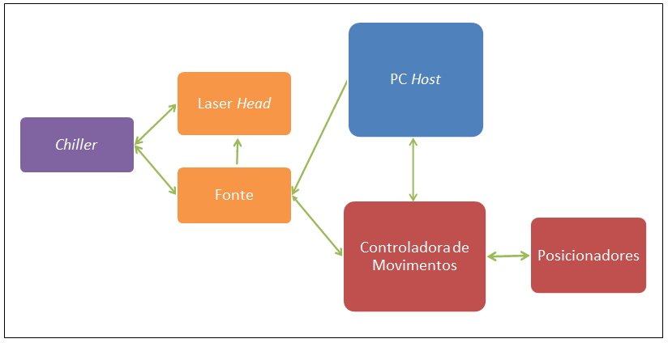

# cti_interface_ProcImagens

Control software for processing of materials and devices by ultraviolet laser.

Interface para controle de movimentos: Newport XPS C8 Motion Controller Software desenvolvido durante projeto de mestrado na FEEC Unicamp com o título: 'Software de Controle para Sistema de Processamento de Materiais e Dispositivos por Laser Ultravioleta'. Em colaboração com o Centro de Pesquisa CTI Renato Archer - www.cti.gov.br na Divisão de Tecnologias Tridimensionais - DT3D. 

Desenvolvido por Patrícia Silva Domingues.

**Versions**
Python 2.7 (limitação pela biblioteca da controladora de movimentos/Newport)
PIL -> 1.1.7
Numpy -> 1.6.1
Scipy -> 0.9.0
Scikit-image->0.11.2
Matplotlib -> 1.1.1rc0

Software Interface: Newport XPS C8 Motion Controller with:

*Image processing:
- Label Image Regions: Segmentation-use .PNG file.
- Sobel Edge map: Image edge detection Filter.
- Skeletonization: Reduces binary objects to 1 pixel wide representations.
It's possible to See SubImages: after using 'Label Image Regions' and Choosing a number to See the segmentation part in Image File.

*Image Execution: for this guide is used :
Synchronization of the output pulses from the motion controller to trigger IN the ultraviolet laser.
Sequence to perform Synchronization:
- 'Read Image File' -> 'Create Displacement Windows' -> 
- Enable external commands in Laser interface: ""GEXT: 1"" -> Execute File

* GEXT: (at laser interface): this command enables or disables the use of the gate control on the analog port - on the power supply. "GEXT: 1" - use the signals on the analog inputs.

Para desenvolvimento deste trabalho, Os seguintes equipamentos do laboratório/CTI foram utilizados:

- Newport RP Reliance Sealed Hole Table Top (mesa com sistema de amortecimento pneumático).
- Pulseo - High Peak Power, Diode Pumped, Q-Switched, 355nm Laser System – Ultraviolet pulses - Laser head - (Laser ultravioleta pulsado) - Neodymium-doped yttrium orthovanadate (Vanadate Crystals) - Nd: YVO_4.
- Newport Spectra-Physics Power Supply model J200 (Fonte do laser).
- Elementos mecânicos de posicionamento e alinhamento.
- Componentes óticos específicos para o comprimento de onda do laser: três espelhos dielétricos com recobrimento antirrefletor e uma lente plano-convexa de ajuste focal.
- Newport High Performance Motion Controller - Driver XPS - C8 (controladora de movimentos) with Real Time O.S. VxWorks 5.4.2; kernel 1.25; Web-Server version 2.5.2; stages database version 2.6.5.
- Newport High-Performance Long-Travel Linear Motor Stages - IMS400-LM (Posicionadores Lineares) – X and Y axes, with the following configurations: travel: 400mm; resolution: 0,02μm; maximum speed: 500mm/s.
- Newport Precision Vertical Stage – VP-5ZA (Posicionador Vertical) – Z axis, with the following configurations: travel: 4,8mm; resolution: 0,06μm; speed: 5mm/s. Positioner to perform the focal adjustment according to the thickness of the substrate.
- Newport Motorized Stepper - Linear Actuator – CMA-25CCCL (Atuador Linear), with the following configurations: travel: 25mm; resolution: 0,2μm; speed: 0.4mm/s. The actuator is used when it is necessary to accommodate parts with a thickness greater than Z axis offset. It vertically moves the focus lens arm to keep proper focal adjustment.
- PolyScience Recirculator Chiller (Recirculador ligado à fonte e ao laser head).

